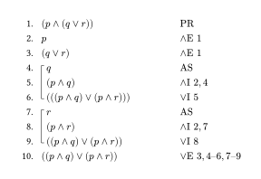

# Turnstile

_[turnstile](<https://en.wikipedia.org/wiki/Turnstile_(symbol)>): the ⊢ symbol, denoting implication\_

A Typst package for typesetting Finch-style natural deduction proofs:

<table>
<tr>
<th>Example</th>
<th>Output</th>
</tr>
<tr>
<td>

```typ
#ndproof[
	/ premise: $(p and (q or r))$
	/ have: $p$ #by(elimand(1))
	/ have: $(q or r)$ #by(elimand(1))

	/ subproof:
		/ have: $q$ #by(AS)
		/ have: $(p and q)$ #by(introand(2, 4))
		/ have: $(((p and q) or (p and r)))$ #by(introor(5))

	/ subproof:
		/ have: $r$ #by(AS)
		/ have: $(p and r)$ #by(introand(2, 7))
		/ have: $((p and q) or (p and r))$ #by(introor(8))

	/ have: $((p and q) or (p and r))$ #by(elimor(3, (4, 6), (7, 9)))
]
```

</td>
<td>

</td>
</tr>
</table>

## Motivation

I needed to typeset natural deduction proofs for a university course. While there are existing Typst packages to do this, such as [derive-it](https://github.com/0rphee/derive-it), I found the syntax a bit clunky compared to more established LaTeX packages such as [fitch](https://www.mathstat.dal.ca/~selinger/fitch/). This project was my attempt to bridge the gap ~~and also a nice distraction from doing actual work~~.

## Installation

This package has not been released on the Typst Universe. I have not decided whether I want to take on the maintenance burden. That said, it is easy enough to clone this project locally via

```
git clone https://github.com/jo3-l/turnstile
```

and then import `turnstile/lib.typ` directly.

## License

MIT
